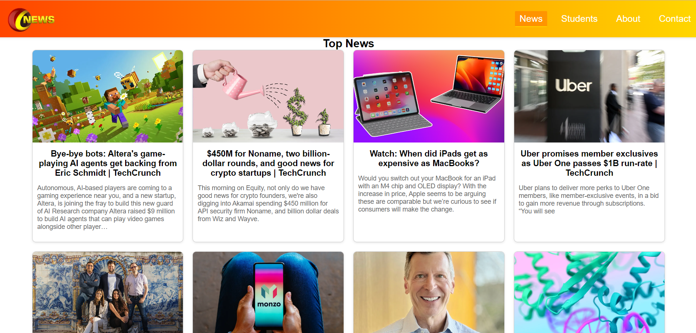
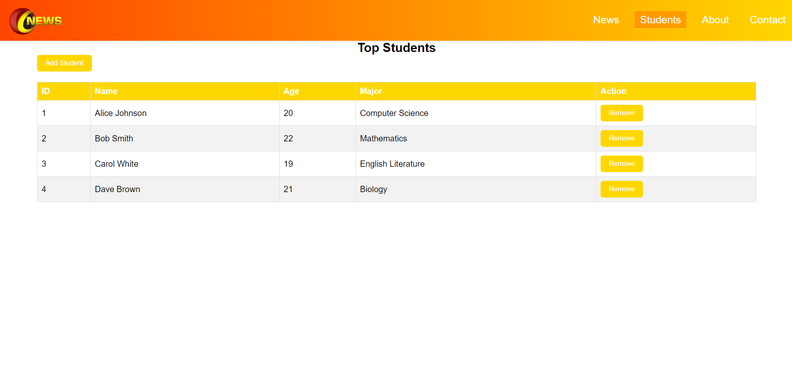
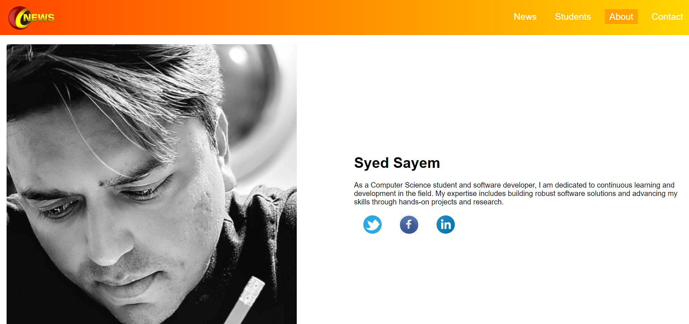
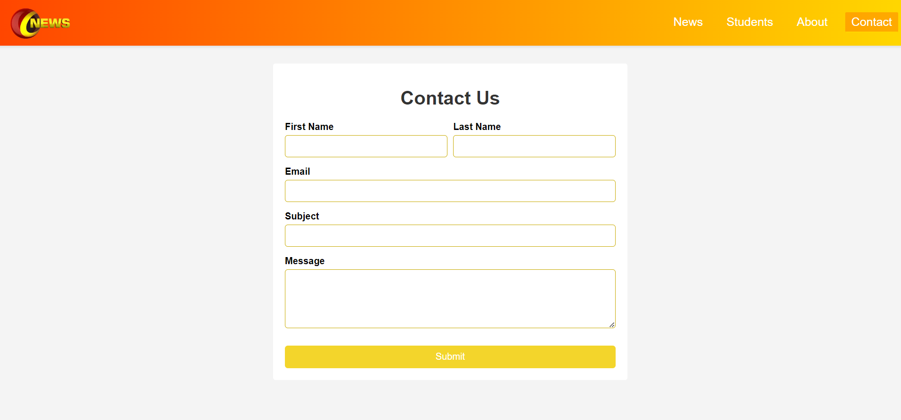

 

  

<!-- TABLE OF CONTENTS -->

  
Table of Contents

  <ol>
    <li>
      <a href="#about-the-project">About The Project</a>
      <ul>
        <li><a href="#built-with">Built With</a></li>
      </ul>
    </li>
    <li><a href="#contact">Contact</a></li>
  </ol>

<!-- ABOUT THE PROJECT -->
## About The Project

It's a multipurpose HTML CSS theme.
some details will be there, WILL ADD LATER.

### Built With

This theme is build with:-
<ol>
  <li>HTML5</li>
  <li>CSS3</li>
  <li>JAVASCRIPT</li>
</ol>

<!-- CONTACT -->
## Contact

Sayed Sayem  - email@example.com

Project Link: [https://github.com/ssayem1978/my-awesome-theme](https://github.com/ssayem1978/my-awesome-theme)
<!-- https://www.markdownguide.org/basic-syntax/#reference-style-links -->
